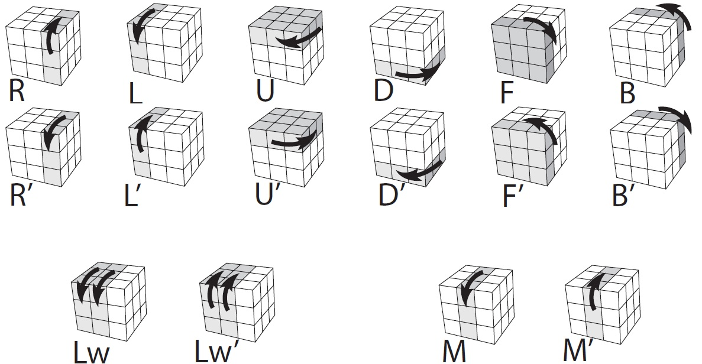

# Rubik's Cube Solver



Brute-force Rubik's cube solver in C. Finds solutions up to 7 moves using recursive DFS.

## Build & Run

```bash
gcc -g program.c cubo.c -o program
./program
```

## How it works

The solver builds a search tree where each node is a cube state. From each state it applies all 14 possible moves (R, R', L, L', U, U', D, D', F, F', B, B', M, M') and checks if the result is solved. It explores up to 7 levels deep. Once a solution is found, it prints the move sequence and stops.

This is depth-first search with a depth limit of 7. The worst case explores 14^7 ≈ 105 million nodes, so cubes requiring more than 7 moves will not be solved (a fully scrambled cube can require up to 20 moves).

## Input

Hold the cube with the **white center facing you** and **orange center on top**. Enter each face as 9 characters (row by row, left to right):

```
Cara FRONTAL (blanco al centro): bbbbbbbbb
Cara DERECHA (azul al centro):   aaaaaaaaa
Cara DETRAS  (amarillo centro):  AAAAAAAAA
Cara IZQUIER (verde al centro):  vvvvvvvvv
Cara ARRIBA  (naranja centro):   nnnnnnnnn
Cara ABAJO   (rojo al centro):   rrrrrrrrr
```

Color codes: `b`=white `a`=blue `A`=yellow `v`=green `n`=orange `r`=red

## Move notation

| Output | Move |
|--------|------|
| `r` | R (right face clockwise) |
| `R` | R' (right face counter-clockwise) |
| `l` | L (left face clockwise) |
| `L` | L' (left face counter-clockwise) |
| `u` | U (top face clockwise) |
| `U` | U' (top face counter-clockwise) |
| `d` | D (bottom face clockwise) |
| `D` | D' (bottom face counter-clockwise) |
| `f` | F (front face clockwise) |
| `F` | F' (front face counter-clockwise) |
| `b` | B (back face clockwise) |
| `B` | B' (back face counter-clockwise) |
| `m` | M (middle slice, same direction as L) |
| `M` | M' (middle slice counter-clockwise) |

All moves are performed with the cube in the original orientation (white front, orange top).

## Run tests

```bash
gcc -g test.c cubo.c -o test_runner && ./test_runner
```
